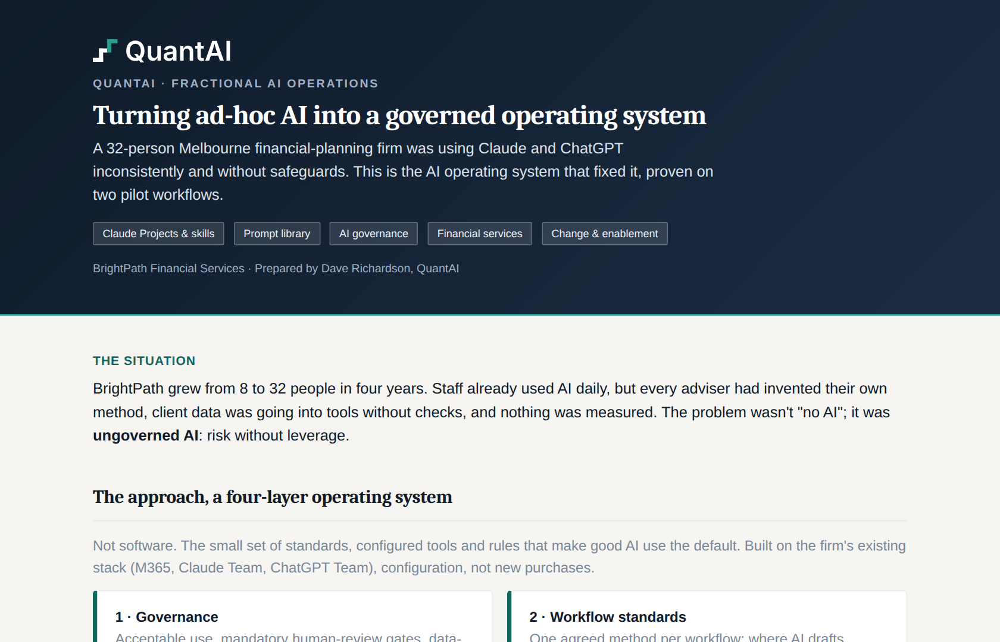
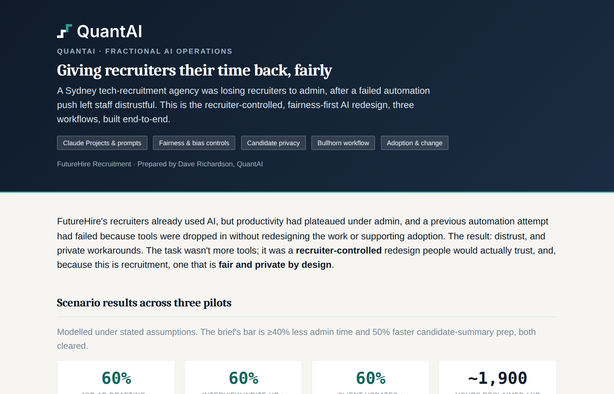
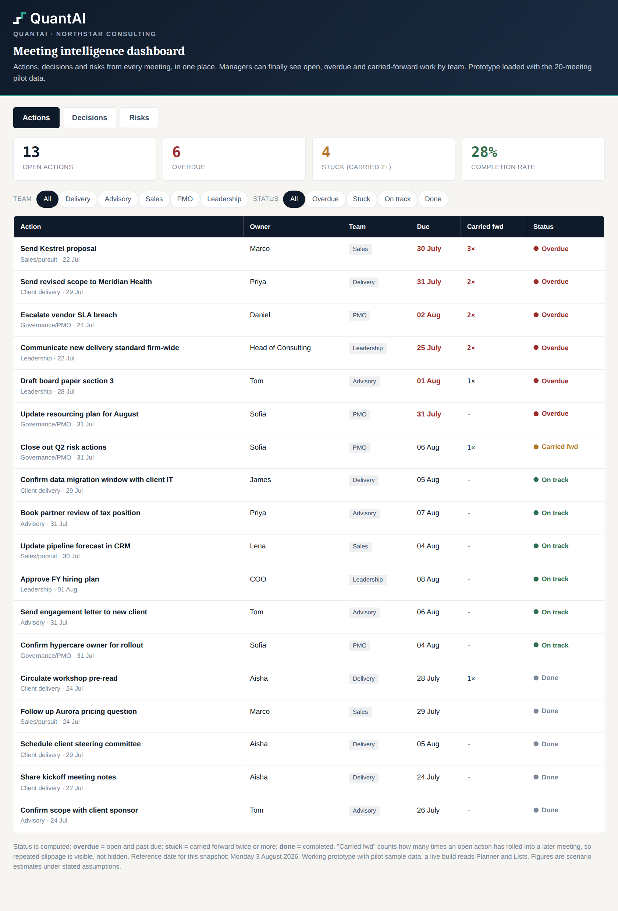
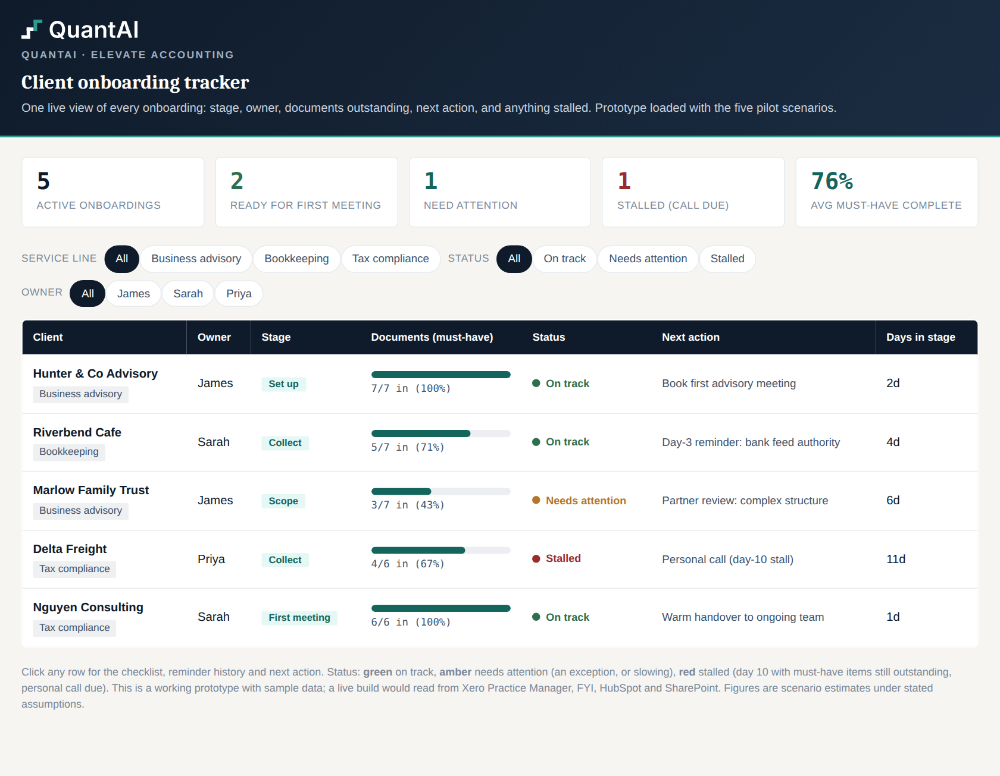
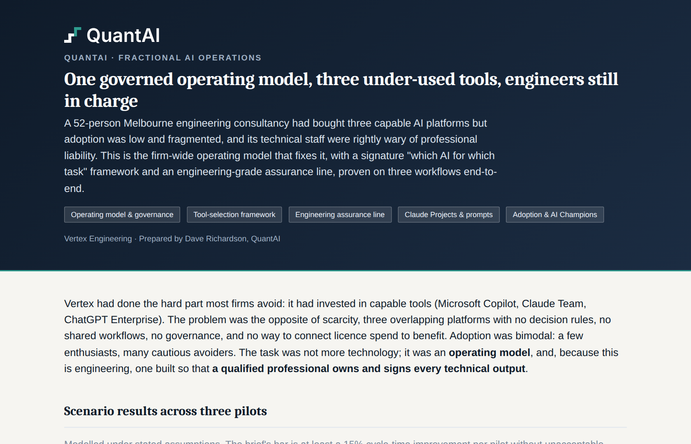

# QuantAI, AI Operations Demonstration Projects

I'm Dave Richardson. QuantAI helps professional services firms redesign how their work actually gets done with AI: less admin, more consistent quality, and teams who genuinely use the tools, with a qualified human kept in charge of the decisions that matter.

This repository holds five worked demonstration projects. Each one takes a realistic brief for a firm in a different sector and builds the whole thing end to end: the strategy, the working prototypes (Claude Projects, prompt libraries, live dashboards), the diagrams, a before and after benefits model, editable SOPs, and a walkthrough. They are built around representative client scenarios to show the method and the standard of the work, so the figures are modelled estimates under stated assumptions, not measured client outcomes.

**How I work:** consent-based interviews to understand the real workflows, a clear brief we agree on, delivery with Claude, Cowork and Code, then the enablement to make it stick. There is a short one-pager on this in [`how-i-work/`](how-i-work/QuantAI_How_I_Work.html).

> A quick note on the files: the case studies, dashboards and walkthroughs are HTML, built to open in a browser. GitHub shows them as source, so to see them rendered, download the repo (or a single file) and open it locally.

---

## The five projects

### 1. BrightPath, an AI operating system for a financial-planning firm

A 32-person Melbourne advice firm using Claude and ChatGPT daily, but inconsistently and without safeguards. A four-layer operating system (governance, workflow standards, configured tools, people), proven on two pilots, with the human-review gate and the best-interests duty kept front and centre.

[Case study](01_brightpath-ai-operating-system/case-study/index.html) · [Walkthrough demo](01_brightpath-ai-operating-system/walkthrough/demo.html) · [Full project](01_brightpath-ai-operating-system/)

### 2. FutureHire, a recruitment AI transformation

A Sydney tech-recruitment agency where recruiters were drowning in admin, after a failed automation attempt left them wary. Three recruiter-controlled workflows, with a fairness guard that keeps interview summaries to job-relevant evidence and never lets AI screen, rank or decide on a candidate.

[Case study](02_futurehire-recruitment-ai/case-study/index.html) · [Walkthrough demo](02_futurehire-recruitment-ai/walkthrough/demo.html) · [Full project](02_futurehire-recruitment-ai/)

### 3. NorthStar, a meeting intelligence platform

A 65-person consultancy running about 120 meetings a week, losing decisions and actions in the transcripts. A five-type meeting taxonomy, an assistant that turns a transcript into an owned record (and never invents an action owner), and a working dashboard where managers can finally see overdue and carried-forward work by team.

[Live dashboard](03_northstar-meeting-intelligence/dashboard/index.html) · [Case study](03_northstar-meeting-intelligence/case-study/index.html) · [Walkthrough demo](03_northstar-meeting-intelligence/walkthrough/demo.html) · [Full project](03_northstar-meeting-intelligence/)

### 4. Elevate, client onboarding optimisation

An 18-person Brisbane accounting firm whose onboarding varied by partner, with documents arriving late and no shared view of what had stalled. One common journey across three service lines, an onboarding assistant, and a live tracker that flags a stall at day 10 and switches the next step to a personal call, not another automated email.

[Live tracker](04_elevate-accounting-client-onboarding/tracker/index.html) · [Case study](04_elevate-accounting-client-onboarding/case-study/index.html) · [Walkthrough demo](04_elevate-accounting-client-onboarding/walkthrough/demo.html) · [Full project](04_elevate-accounting-client-onboarding/)

### 5. Vertex, an AI operating model for an engineering consultancy

A 52-person Melbourne engineering firm with three overlapping AI platforms and no rules for which to use when. A firm-wide operating model with a signature "which AI for which task" framework, and an engineering assurance line where AI drafts the words around a report but never performs, checks, verifies or certifies the engineering itself.

[Case study](05_vertex-engineering-ai-operating-model/case-study/index.html) · [Walkthrough demo](05_vertex-engineering-ai-operating-model/walkthrough/demo.html) · [Full project](05_vertex-engineering-ai-operating-model/)

---

## What's in each project

Every project folder follows the same shape: `docs/` for the strategy and design, `prompts/` and `claude-project/` for the working AI assets, `diagrams/` for the current and future-state process maps, `tools/` for a reproducible benefits model, `deliverables/` for the rendered Word and Excel outputs, `walkthrough/` for the narration script and clickable demo, and `case-study/` for the one-page overview. Two of them (NorthStar and Elevate) also include a working, clickable dashboard prototype.

## An honest note

These are demonstration projects built around representative client scenarios, not paid client engagements. They are here to show how I work and the standard I hold. Every figure is a modelled estimate under the assumptions stated inside each project, and the sector-specific governance line (human review, no regulated advice from AI, professional accountability kept human) is real and deliberate in every one.

## Get in touch

Dave Richardson, QuantAI · [dave@quantai.com.au](mailto:dave@quantai.com.au) · quantai.com.au
